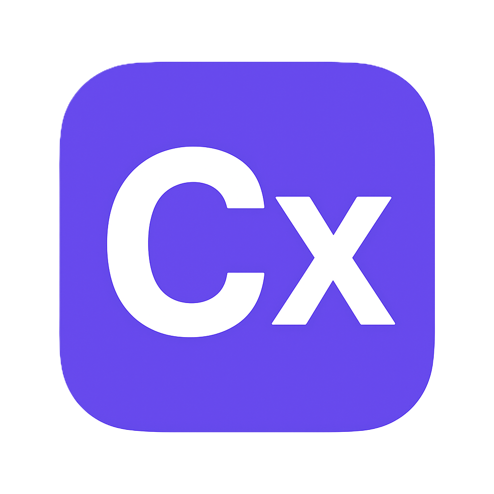

<div align="center">
  
  
  # ✨ CanvasX
  
  ### A Beautiful & Intuitive Drawing Canvas
  
  *Create stunning hand-drawn diagrams, sketches, and illustrations with ease*
  
  [](https://react.dev/)
  [](https://vitejs.dev/)
  [](https://tailwindcss.com/)
  [](https://zustand-demo.pmnd.rs/)
  
  [✨ Features](#-features) • [🚀 Quick Start](#-quick-start) • [🎨 Usage](#-usage) • [⚙️ Tech Stack](#️-tech-stack) • [📖 Documentation](#-documentation)
  
</div>

---

## 🎯 Overview

**CanvasX** is a modern, feature-rich drawing application inspired by Excalidraw. Built with React and powered by RoughJS, it provides a delightful hand-drawn aesthetic while maintaining professional-grade functionality. Whether you're sketching ideas, creating diagrams, or designing wireframes, CanvasX offers an elegant and intuitive experience.

## ✨ Features

### 🎨 Drawing Tools

- **✏️ Freehand Drawing** - Sketch naturally with smooth, responsive brush strokes
- **📐 Shape Tools** - Rectangle, Circle/Ellipse, Arrow, and Line tools
- **🔤 Text Tool** - Add editable text labels to your canvas
- **🧹 Eraser** - Remove elements with precision
- **👆 Select Tool** - Move, resize, and manipulate elements with ease

### 🎭 Styling Options

- **🌈 Color Palette** - Comprehensive color picker for stroke and fill
- **📏 Stroke Width** - Adjustable line thickness (Thin, Medium, Thick, Extra)
- **💫 Opacity Control** - Fine-tune element transparency
- **🎨 Hand-Drawn Style** - Beautiful rough, sketch-like aesthetics powered by RoughJS

### ⚡ Professional Features

- **↩️ Undo/Redo** - Full history management with keyboard shortcuts
- **📋 Multi-Canvas Support** - Create and manage unlimited canvases
- **💾 Auto-Save** - Automatic saving with visual feedback
- **🎯 Element Alignment** - Align selected elements (left, center, right, top, middle, bottom)
- **📊 Layer Controls** - Send to back, bring to front, send backward, bring forward
- **⌨️ Keyboard Shortcuts** - Efficient workflow with extensive keyboard support
- **📤 Export** - Save your work as PNG, SVG, or JSON

### 🎨 Modern UI/UX

- **✨ Elegant Design** - Clean, minimal interface with gradient accents
- **🎯 Floating Actions** - Quick access to essential features
- **📱 Responsive Layout** - Collapsible sidebar for maximum canvas space
- **🌟 Visual Feedback** - Smooth animations and state indicators

## 🚀 Quick Start

### Prerequisites

- **Node.js** (v18 or higher)
- **npm** or **yarn** package manager

### Installation

1. **Clone the repository**

   ```bash
   git clone <your-repo-url>
   cd excalidraw-clone
   ```

2. **Install dependencies**

   ```bash
   npm install
   # or
   yarn install
   ```

3. **Start the development server**

   ```bash
   npm run dev
   # or
   yarn dev
   ```

4. **Open your browser**
   ```
   Navigate to http://localhost:5173
   ```

### Build for Production

```bash
npm run build
# or
yarn build
```

The optimized production build will be in the `dist/` directory.

## 🎨 Usage

### Creating Your First Drawing

1. **Select a Tool** - Click on any tool from the top toolbar (V, H, R, O, D, A, T, E)
2. **Draw on Canvas** - Click and drag to create shapes or draw freely
3. **Style Your Elements** - Use the sidebar to customize colors, stroke width, and opacity
4. **Select & Edit** - Press `V` or click the select tool to move and resize elements
5. **Auto-Save** - Your work is automatically saved to localStorage

### Keyboard Shortcuts

| Shortcut               | Action             |
| ---------------------- | ------------------ |
| `V`                    | Select Tool        |
| `H`                    | Hand/Pan Tool      |
| `R`                    | Rectangle Tool     |
| `O`                    | Ellipse Tool       |
| `D`                    | Draw Tool          |
| `A`                    | Arrow Tool         |
| `T`                    | Text Tool          |
| `E`                    | Eraser Tool        |
| `Ctrl/Cmd + Z`         | Undo               |
| `Ctrl/Cmd + Y`         | Redo               |
| `Ctrl/Cmd + Shift + Z` | Redo (Alternative) |
| `Ctrl/Cmd + A`         | Select All         |
| `Delete/Backspace`     | Delete Selected    |

### Managing Canvases

- **Create New** - Click "My Canvases" → "New Canvas"
- **Switch Canvas** - Open canvas manager and select any canvas
- **Rename** - Edit canvas name directly in the manager
- **Delete** - Remove unwanted canvases from the list

### Exporting Your Work

1. Click the **Export** button in the floating actions
2. Choose your format:
   - **PNG** - Raster image with transparent background
   - **SVG** - Vector format for scalability
   - **JSON** - Save complete canvas data for re-importing

## ⚙️ Tech Stack

### Core Technologies

- **[React 19.1.1](https://react.dev/)** - Modern UI library with latest features
- **[Vite 7.1.7](https://vitejs.dev/)** - Lightning-fast build tool
- **[Tailwind CSS 4.1.14](https://tailwindcss.com/)** - Utility-first styling framework

### State Management & Drawing

- **[Zustand 5.0.8](https://zustand-demo.pmnd.rs/)** - Lightweight state management
- **[RoughJS 4.6.6](https://roughjs.com/)** - Hand-drawn graphics library

### Utilities

- **[Lucide React 0.545.0](https://lucide.dev/)** - Beautiful icon library
- **[NanoID 5.1.6](https://github.com/ai/nanoid)** - Unique ID generation
- **[React Hotkeys Hook 5.2.0](https://github.com/JohannesKlauss/react-hotkeys-hook)** - Keyboard shortcut management

## 📖 Documentation

### Project Structure

```
excalidraw-clone/
├── public/              # Static assets
│   └── favicon.png     # App icon
├── src/
│   ├── components/     # React components
│   │   ├── Canvas/     # Main drawing canvas
│   │   ├── Toolbar/    # Top toolbar with tools
│   │   ├── Sidebar/    # Left sidebar for styling
│   │   ├── FloatingActions/  # Bottom-right quick actions
│   │   ├── CanvasManager/    # Multi-canvas management
│   │   ├── AutoSaveIndicator/ # Save status indicator
│   │   └── UI/         # Reusable UI components
│   ├── store/          # Zustand state stores
│   │   ├── canvasStore.js    # Canvas & elements state
│   │   ├── editorStore.js    # Editor settings
│   │   └── historyStore.js   # Undo/redo history
│   ├── tools/          # Drawing tool implementations
│   ├── utils/          # Helper functions
│   │   ├── renderer.js       # Canvas rendering
│   │   ├── export.js         # Export functionality
│   │   ├── storage.js        # LocalStorage management
│   │   └── migration.js      # Data versioning
│   ├── hooks/          # Custom React hooks
│   └── constants/      # App constants
├── index.html          # HTML entry point
├── package.json        # Dependencies
└── vite.config.js     # Vite configuration
```

### Key Concepts

#### 1. **Canvas State Management**

The app uses Zustand for efficient state management with three main stores:

- `canvasStore` - Manages multiple canvases and elements
- `editorStore` - Handles current tool, colors, and settings
- `historyStore` - Maintains undo/redo history

#### 2. **Drawing Engine**

RoughJS provides the hand-drawn aesthetic:

```javascript
import rough from "roughjs/bundled/rough.esm";
const rc = rough.canvas(canvasElement);
rc.rectangle(x, y, width, height, { stroke: color });
```

#### 3. **Auto-Save System**

Automatic saving with debouncing (2-second delay):

- Monitors canvas changes
- Saves to localStorage
- Shows visual feedback
- Prevents data loss

#### 4. **Export System**

Multiple export formats supported:

- **PNG** - HTML Canvas to Blob conversion
- **SVG** - Direct RoughJS SVG generation
- **JSON** - Complete state serialization

## 🎯 Development Phases

This project was built in incremental phases:

1. **Phase 1-2** - Project setup, basic canvas
2. **Phase 3** - Core drawing tools
3. **Phase 4** - RoughJS integration
4. **Phase 5** - Undo/Redo system
5. **Phase 6** - Multi-canvas support
6. **Phase 7** - Advanced selection & manipulation
7. **Phase 8** - Alignment & layer controls
8. **Phase 9** - Auto-save & persistence ✨
9. **Future** - Collaboration, cloud sync, templates

## 🤝 Contributing

Contributions are welcome! Please feel free to submit a Pull Request.

1. Fork the repository
2. Create your feature branch (`git checkout -b feature/AmazingFeature`)
3. Commit your changes (`git commit -m 'Add some AmazingFeature'`)
4. Push to the branch (`git push origin feature/AmazingFeature`)
5. Open a Pull Request

## 📝 License

This project is open source and available under the [MIT License](LICENSE).

## 🙏 Acknowledgments

- **[Excalidraw](https://excalidraw.com/)** - Inspiration for the project
- **[RoughJS](https://roughjs.com/)** - Amazing hand-drawn graphics library
- **[Lucide Icons](https://lucide.dev/)** - Beautiful open-source icons
- **React Community** - For the amazing ecosystem

---

<div align="center">
  
  **Built with ❤️ using React & Tailwind CSS**
  
  *If you found this project helpful, please consider giving it a ⭐*
  
</div>

## React Compiler

The React Compiler is not enabled on this template because of its impact on dev & build performances. To add it, see [this documentation](https://react.dev/learn/react-compiler/installation).

## Expanding the ESLint configuration

If you are developing a production application, we recommend using TypeScript with type-aware lint rules enabled. Check out the [TS template](https://github.com/vitejs/vite/tree/main/packages/create-vite/template-react-ts) for information on how to integrate TypeScript and [`typescript-eslint`](https://typescript-eslint.io) in your project.
